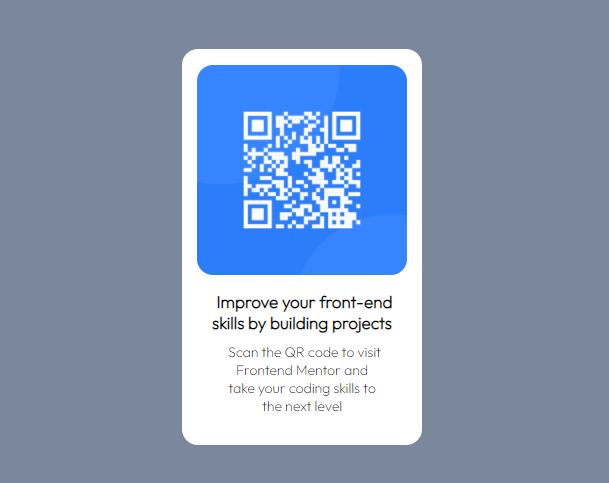

# Frontend Mentor - QR code component solution

This is a solution to the [QR code component challenge on Frontend Mentor](https://www.frontendmentor.io/challenges/qr-code-component-iux_sIO_H). Frontend Mentor challenges help you improve your coding skills by building realistic projects.

## Table of contents

- [Overview](#overview)
  - [Screenshot](#screenshot)
  - [Links](#links)
- [My process](#my-process)
  - [Built with](#built-with)
  - [What I learned](#what-i-learned)
  - [Continued development](#continued-development)
- [Author](#author)

## Overview

### Screenshot

### Links

- Solution URL: [Add solution URL here]()
- Live Site URL: [Add live site URL here](http://127.0.0.1:5500/qr-code-component-main/index.html)

## My process

### Built with

- Semantic HTML5 markup
- CSS custom properties
- Flexbox

### What I learned

This is my first challenge, There isn`t so much I can talk about because I feel it was simple. First I did a Flowchart to have a simple idea of the tags I will use for the qr code, header and text. This help me wrote the code faster. Then I started with css, I always try to have a indent code to have a good practice for harders challengues in the future. First I go for flexbox, having a simple view of the things in the screen. Finally I did some changes, for example the margin of the p, to have the fist challengue complete.

Feel free to recommend me whatever you feel I need to change, and sorry for my english im for Argentina haha.

### Continued development

I feel I need to improve the use of display, I feel I don`t understand the using of block or flex-box at all.

## Author

- Frontend Mentor - [@Foruuk](https://www.frontendmentor.io/profile/Foruuk)
